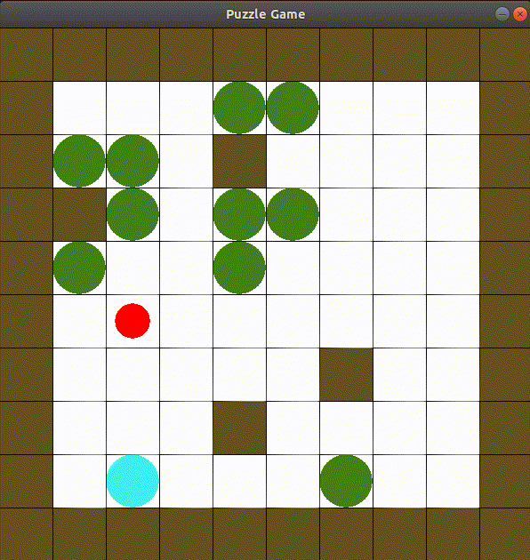

 # 
 🧩 Puzzle Game 

## Table of Contents

* [About the Game](#about-the-game)
  * [Built With](#built-with)
  * [How to Play](#how_to_play)
	  * [Objects](#objects)
	  * [Rules](#rules)
	  * [Goal](#goal)
* [Contact](#contact)

<!-- ABOUT THE Game -->
## About The Game
This is a simple puzzle game with three levels.

### Built With

* [Pygame](https://www.pygame.org/)

### How to Play
Use the **arrow keys** on the keyboard to navigate the player.

#### Objects

The objects in the game represent:
 | | | 
 |--|--|
|  Red Circle  |⇒  Player🚶‍♂️ |
| Green Circle  |⇒ Box 📦 |
| Blue Circle |⇒ Final Point 🥇
|Brown Square|⇒  Wall 🧱|

#### Rules

 1. You can push one or multiple boxes at once.
 2. **Walls** and the **Final Point** block the boxes.
 3. You cannot push a wall or pass through it.

#### Goal
The goal is to get the player to the final point.

<!-- CONTACT -->
## Contact
Parisa Rabbany - Parisa.Rabbany.pr@gmail.com

